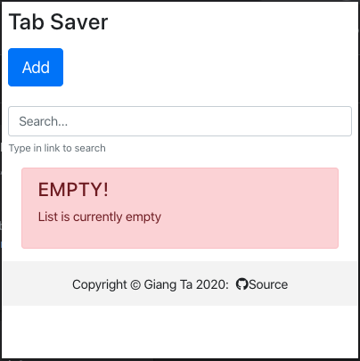

<p align="center">

</p>

A google chrome extension that allows user to save interesting tabs to read later (if they ever want to) without clustering their bookmark bar.

<p align="center">

</p>

## Installation

* Clone the repo and cd into it
* Run ```npm install```
* Run ```npm run build```

## Tech Stack

* [React](https://reactjs.org/)
* [Bootstrap4](https://getbootstrap.com/)
* [Extension Logo is made by Flaticon](https://www.flaticon.com/)
